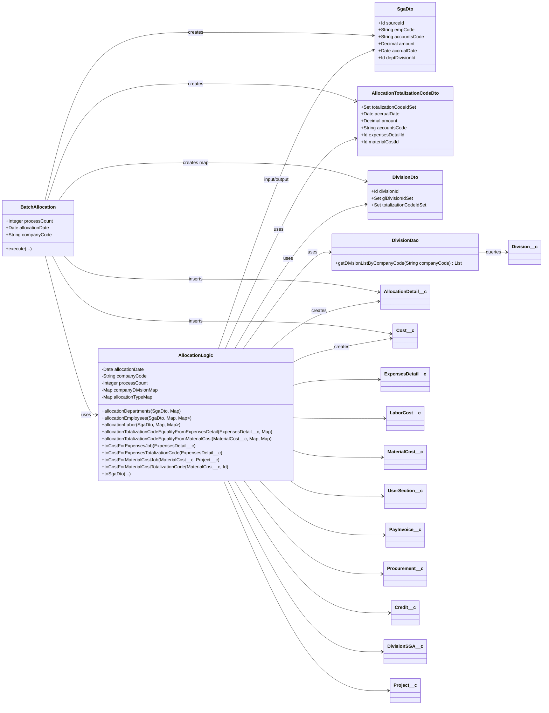

## 1. システムの概要
本クラスは、Salesforce 上で動作する原価・販管費の配賦ロジックを集約したドメインサービスクラスです。
既存の BatchCostAllocation を全面改修し、計算ロジックを AllocationLogic に集約することで、以下を目的としています。

- 販管費（経費・労務費・請求書払い・仕入・部門販管費等）の配賦
- 部門配賦（対象部門配下の GL への均等配賦）
- カンパニー販管費の従業員への配賦（兼務割合考慮）
- 労務費の従業員所属部門への配賦（兼務割合考慮）
- 原価（Cost__c）の生成
- 経費明細（ExpensesDetail__c）・材料費（MaterialCost__c）から原価レコードを生成
- JOB 用／集計コード用／集計コード均等配賦用など、複数パターンに対応
- 各種元データからの DTO（SgaDto / AllocationTotalizationCodeDto）への変換

これにより、バッチクラス BatchAllocation からは「いつ・何を・どの区分で配賦するか」を引き渡し、
「どのように配賦するか」は AllocationLogic に委譲する構造になっています。

## 2. モジュール構成と各機能の説明
### 2.1. クラス全体構成

```
public with sharing class AllocationLogic {
    // コンテキスト情報
    private Date allocationDate;
    private String companyCode;
    private Integer processCount;

    // 部門・配賦種別キャッシュ
    private Map<Id, Division__c> companyDivisionMap;
    private Map<Integer, String> allocationTypeMap;

    private final String ACCOUNTSCODE_CREDIT = '7300';

    // コンストラクタ ... 以降、各種配賦・変換処理
}
```

- allocationDate

配賦処理基準日（原価計上日・仕掛判定などに使用）

- companyCode

会社コード。生成される AllocationDetail__c や Cost__c に設定。

- processCount

バッチ実行区分。BatchAllocation.EXEC_XXXX と対応し、
allocationTypeMap により配賦種別文字列（例：経費(部門配賦)）に変換。

- companyDivisionMap

DivisionDao.getDivisionListByCompanyCode(companyCode) による部門マスタキャッシュ。

- allocationTypeMap

processCount → 配賦種別ラベルの対応付け。

### 2.2. コンストラクタ

```
public AllocationLogic(Date allocationDate, Integer processCount, String companyCode)
```

- バッチ開始時に一度生成され、全処理で共通のコンテキストを保持。
- allocationTypeMap を初期化し、processCount に応じた配賦区分名を提供。

### 2.3. 販管費の配賦処理モジュール
#### 2.3.1. 部門配賦：allocationDepartments

```
public List<AllocationDetail__c> allocationDepartments(SgaDto sgaDto, Map<Id, DivisionDto> divMap)
```

役割
- 販管費（SgaDto）を「部門配賦」するロジック。
- 対象部門（sgaDto.deptDivisionId）配下の GL 部門に対し、均等配賦を行う。

主な処理
1. 金額 0 の場合は即終了。
2.	部門 ID / 科目コードの必須チェック。未指定時は AgrexRuntimeException をスロー。
3.	対象部門の DivisionDto.glDivisionIdSet を取得し、存在しない場合は例外。
4.	allocationGlDivision により GL 部門単位に均等配賦し、AllocationDetail__c を生成。

#### 2.3.2 カンパニー販管費の従業員配賦：allocationEmployees

```
public List<AllocationDetail__c> allocationEmployees(
    SgaDto sgaDto,
    Map<Id, DivisionDto> divMap,
    Map<String, List<UserSection__c>> userSecMap
)
```

役割
- カンパニー全体の販管費を社員単位に配賦し、さらに従業員の兼務割合に応じて部門へ配賦する。
- userSecMap は「社員コード → 所属部門(兼務含む)リスト」。

主な処理
1.	金額 0 の場合は終了。
2.	対象従業員数（userCount）取得。0 の場合は例外。
3.	科目コード必須チェック。
4.	販管費総額を userCount で割り、一人当たり金額を算出。
端数は最後の従業員に寄せるロジック。
5.	各従業員について：
    -	兼務割合の合計（percentDenominator）を算出。0 の場合例外。
    -	allocationUserSection を呼び、兼務割合を考慮して部門配賦。

#### 2.3.3. 労務費配賦：allocationLabor

```
public List<AllocationDetail__c> allocationLabor(
    SgaDto sgaDto,
    Map<Id, DivisionDto> divMap,
    Map<String, List<UserSection__c>> userSecMap
)
```

役割
-	労務費を従業員所属部門の兼務割合に基づいて配賦。

主な処理
1.	金額／科目コード／従業員コードの必須チェック。
2.	userSecMap に対応する従業員コードが存在しない場合は例外。
3.	兼務割合合計（percentDenominator）が 0 なら例外。
4.	allocationUserSection に総額を渡して配賦処理を行う。

#### 2.3.4. 兼務割合考慮の部門配賦：allocationUserSection

```
@TestVisible
private List<AllocationDetail__c> allocationUserSection(
    SgaDto sgaDto,
    Map<Id, DivisionDto> divMap,
    List<UserSection__c> userSecList,
    Decimal percentDenominator,
    Decimal totalAmount
)
```

役割
-	一人の従業員に対して、兼務割合（Percent__c）にもとづき所属部門へ金額を配賦。

主な処理
1.	各 UserSection__c について：
 -	対象部門が divMap に存在するか確認。なければ例外。
 -	対象部門の GL 部門セット（glDivisionIdSet）取得。空なら例外。
2.	兼務割合に応じた金額算出
 -	最後の部門は「総額 − これまでの合計額」で端数調整。
 -	その他は totalAmount * userSec.Percent__c / percentDenominator を四捨五入。
3.	算出した部門単位金額を allocationGlDivision で GL に均等配賦。

#### 2.3.5. GL 単位均等配賦：allocationGlDivision

```
@TestVisible
private List<AllocationDetail__c> allocationGlDivision(
    SgaDto sgaDto,
    UserSection__c userSection,
    Set<Id> glDivisionIdSet,
    Decimal totalAmount
)
```

役割
-	部門レベルで配賦すべき金額を、GL 部門単位へ均等配賦し、AllocationDetail__c を生成。

主な処理
1.	GL 部門数で標準金額（四捨五入）を算出。
2.	ループ最終 GL に端数を寄せる。
3.	各 GL 部門ごとに createAllocationDetail を呼び、配賦明細を生成。

#### 2.3.6. 配賦明細生成：createAllocationDetail

```
private AllocationDetail__c createAllocationDetail(
    SgaDto sgaDto,
    UserSection__c userSection,
    Decimal userAmount,
    Id divisionId,
    Decimal amount
)
```

役割
-	各配賦結果を 1 レコードの AllocationDetail__c にマッピング。

主な処理
1.	companyDivisionMap が空であれば DivisionDao.getDivisionListByCompanyCode(companyCode) で初期化。
2.	対象 GL 部門（Division__c）とその親階層（GM/Dept/HQ）をたどり、各種 Division 項目をセット。
3.	金額 (Amount__c)・元オブジェクト ID・元金額等をセット。
4.	processCount に応じて、どの参照項目（ExpensesDetail__c, LaborCost__c など）に紐付けるかを切り替え。
5.	userSection がある場合は「ユーザ所属部門情報（TargetUserXXX）」をセット。
ない場合は、部門販管費として TargetDivision__c 等を設定。

### 2.4. 原価の配賦処理モジュール
#### 2.4.1. 経費 → 集計コード均等配賦：allocationTotalizationCodeEqualityFromExpensesDetail

```
public List<Cost__c> allocationTotalizationCodeEqualityFromExpensesDetail(
    ExpensesDetail__c expensesDetail,
    Map<Id, DivisionDto> allDivMap
)
```

役割
-	経費明細の部門配下の GL にぶら下がる集計コードへ、均等配賦した Cost__c を生成。

主な処理
1.	経費の部門 ID 取得・存在チェック。
2.	部門の GL 部門セット取得・空チェック。
3.	GL 部門配下の集計コード ID をユニークに集約（allocationTargetTcSet）。
4.	集計コード未存在時は例外。
5.	toAllocationTotalizationCodeDto → allocationTotalizationCodeEquality で実データ生成。

#### 2.4.2. 材料費 → 集計コード均等配賦：allocationTotalizationCodeEqualityFromMaterialCost

```
public List<Cost__c> allocationTotalizationCodeEqualityFromMaterialCost(
    MaterialCost__c materialCost,
    Map<String, Division__c> divCodeMap,
    Map<Id, DivisionDto> allDivMap
)
```

役割
-	部門コード指定の材料費を、その部門配下の集計コードへ均等配賦。

主な処理
1.	部門コードから部門オブジェクト取得。未存在なら例外。
2.	部門 ID から GL 部門セット取得。未存在なら例外。
3.	各 GL 部門配下の集計コード ID をユニークに集約。
4.	集計コード未存在時は例外。
5.	toAllocationTotalizationCodeDto → allocationTotalizationCodeEquality 実行。

#### 2.4.3. 集計コード均等配賦本体：allocationTotalizationCodeEquality

```
private List<Cost__c> allocationTotalizationCodeEquality(AllocationTotalizationCodeDto atcDto)
```

役割
-	集計コード Set に対し、金額を均等配賦して Cost__c を生成。

主な処理
1.	集計コード数チェック。0 の場合は例外。
2.	集計コード数で金額を割り、最後の集計コードに端数を寄せる。
3.	各集計コードごとに toCostForTotalizationCodeEquality を呼び Cost__c を生成。

### 2.5. 原価オブジェクト変換モジュール
#### 2.5.1. 経費 JOB 用：toCostForExpensesJob

```
public Cost__c toCostForExpensesJob(ExpensesDetail__c expensesDetail)
```

役割
-	「経費明細（JOB 用）」を原価レコード Cost__c に変換。
-	仕掛判定／計上日決定のロジックを内包。

ポイント
-	RecordTypeID__c カスタム設定から案件レコードタイプ判定。
-	費目マスタ ExpenseItem__c.AccountingMethod__c に JOB が含まれるかを判定。
-	JOB でない場合／特定レコードタイプ（社内取引・PRE）ごとに salesCostDate を決定。

#### 2.5.2. 経費 集計コード用：toCostForExpensesTotalizationCode

```
public Cost__c toCostForExpensesTotalizationCode(ExpensesDetail__c expensesDetail)
```

-	経費明細に紐づく集計コードをそのまま Cost__c.TotalizationCode__c に設定。
-	SalesCostDate__c は allocationDate 固定。

#### 2.5.3. 材料費 JOB 用：toCostForMaterialCostJob

```
public Cost__c toCostForMaterialCostJob(MaterialCost__c materialCost, Project__c project)
```

-	材料費を JOB 用の原価として Cost__c に変換。
-	案件レコードタイプに応じて売上原価日を算出（社内取引／PRE／その他）。

#### 2.5.4. 材料費 集計コード用：toCostForMaterialCostTotalizationCode

```
public Cost__c toCostForMaterialCostTotalizationCode(MaterialCost__c materialCost, Id totalizationCodeId)
```

-	材料費を特定の集計コードに紐づける原価レコードを生成。
-	売上原価日は allocationDate 固定。

#### 2.5.5. 集計コード均等配賦用：toCostForTotalizationCodeEquality

```
private Cost__c toCostForTotalizationCodeEquality(
    AllocationTotalizationCodeDto atcDto,
    Id totalizationCodeId,
    Decimal amount
)
```

-	AllocationTotalizationCodeDto から Cost__c を生成する共通メソッド。
-	元データが経費か材料費かに応じて ExpensesDetail__c / MaterialCost__c をセット。

### 2.6. DTO 変換モジュール
#### 2.6.1. 集計コード DTO 変換：toAllocationTotalizationCodeDto
-	経費明細版:

```
private AllocationTotalizationCodeDto toAllocationTotalizationCodeDto(
    ExpensesDetail__c ed,
    Set<Id> totalizationCodeIdSet
)
```

-   材料費版:

```
private AllocationTotalizationCodeDto toAllocationTotalizationCodeDto(
    MaterialCost__c materialCost,
    Set<Id> totalizationCodeIdSet
)
```

-   いずれも:

-	totalizationCodeIdSet
-	accrualDate
-	amount
-	accountsCode
-	元データ ID（expensesDetailId or materialCostId）

を保持するシンプルな DTO。

## 2.7. 販管費 DTO 変換モジュール：toSgaDto

```
public SgaDto toSgaDto(ExpensesDetail__c expensesDetail)
public SgaDto toSgaDto(LaborCost__c laborCost)
public SgaDto toSgaDto(Credit__c credit)
public SgaDto toSgaDto(PayInvoice__c payInvoice)
public SgaDto toSgaDto(Procurement__c procurement)
public SgaDto toSgaDto(DivisionSGA__c divisionSga, Id divId)
```

役割
-	各種原データオブジェクトを、配賦共通フォーマット SgaDto に変換。
-	フィールド：
-	sourceId：元オブジェクト ID
-	empCode：従業員コード（労務費のみ）
-	accountsCode：科目コード
-	amount：対象金額
-	accrualDate：発生日／対象日
-	deptDivisionId：部門（部レベル）の ID

これにより、配賦ロジックはデータ種別に依存せず、SgaDto だけを意識すればよい構造になっています。

## 3. 使用している技術スタック
-	プラットフォーム
    -	Salesforce Platform（Force.com）
-	言語
    -	Apex
-	データストア
    -	Salesforce 標準／カスタムオブジェクト
        -	Division__c（部門）
        -   DivisionSGA__c（部門販管費）
        -	AllocationDetail__c（配賦明細）
        -	Cost__c（原価）
        -	ExpensesDetail__c（経費明細）
        -	LaborCost__c（労務費）
        -	MaterialCost__c（材料費）
        -	PayInvoice__c（請求書払い）
        -	Procurement__c（仕入）
        -	Credit__c（振込手数料）
        -	UserSection__c（ユーザ所属部門）
        -	Project__c（案件）
        -	設定・メタデータ
        -	カスタム設定／カスタムメタデータ RecordTypeID__c
        -	カスタムラベル System.label.ConstTypeJob
        -	バッチ実行
        -	別クラス BatchAllocation から本クラスが利用される前提
        -	BatchAllocation.EXEC_*** 定数により処理モードを切替
-	設定・メタデータ
    -	カスタム設定／カスタムメタデータ RecordTypeID__c
    -	カスタムラベル System.label.ConstTypeJob
-	バッチ実行
    -	別クラス BatchAllocation から本クラスが利用される前提
    -	BatchAllocation.EXEC_*** 定数により処理モードを切替

## 4. データフロー／シーケンス図（テキスト）
シナリオ：経費明細を部門配賦し、AllocationDetail__c を生成
1.	BatchAllocation
    -	ExpensesDetail__c を取得
    -	SgaDto sga = allocationLogic.toSgaDto(expensesDetail)
2.	BatchAllocation
    -	部門配賦用 divMap : Map<Id, DivisionDto> を事前に構築
3.	BatchAllocation
    -	allocationLogic.allocationDepartments(sga, divMap) を呼び出し
4.	AllocationLogic.allocationDepartments
    -	金額 0 / 必須チェック
    -	glDivisionIdSet = divMap.get(sga.deptDivisionId).glDivisionIdSet を取得
    -	allocationGlDivision(sga, null, glDivisionIdSet, sga.amount) を呼び出し
5.	AllocationLogic.allocationGlDivision
    -	GL 部門数で amountOfGlUnit を算出
    -	各 divisionId について端数調整しつつ createAllocationDetail を呼び出し
6.	AllocationLogic.createAllocationDetail
    -	companyDivisionMap から Division__c と親階層を解決
    -	AllocationDetail__c に各種情報をマッピング
    -	processCount に応じて ExpensesDetail__c などの参照を設定
7.	BatchAllocation
    -	返却された List<AllocationDetail__c> を DML で一括登録

### 4.2. カンパニー販管費の従業員配賦
1.	BatchAllocation
    -	カンパニー販管費を SgaDto に変換：toSgaDto(ExpensesDetail__c など)
    -	userSecMap : Map<String, List<UserSection__c>> を構築
2.	BatchAllocation
    -	allocationLogic.allocationEmployees(sgaDto, divMap, userSecMap) 呼び出し
3.	AllocationLogic.allocationEmployees
    -	userCount = userSecMap.size() 取得
    -	一人あたりの販管費 amountOfUserUnit を算出
    -	各 empCode について、最後の従業員に端数を寄せつつ amount を決定
    -	percentDenominator を算出し、allocationUserSection を呼び出し
4.	AllocationLogic.allocationUserSection
    -	各 UserSection__c の Section__c について部門／GL 部門の存在確認
    -	兼務割合に基づき部門ごとの金額を算出
    -	各部門ごとに allocationGlDivision を呼び出し
5.	AllocationLogic.allocationGlDivision
    -	GL 部門へ均等配賦
    -	createAllocationDetail で AllocationDetail__c を生成（TargetUserXXX をセット）
6.	BatchAllocation
    -	AllocationDetail__c を一括登録

### 4.3. 経費 → 集計コード均等配賦（原価生成）
1.	BatchAllocation
    -	ExpensesDetail__c と部門 DTO allDivMap を取得
2.	BatchAllocation
    -	allocationLogic.allocationTotalizationCodeEqualityFromExpensesDetail(expensesDetail, allDivMap) 呼び出し
3.	AllocationLogic.allocationTotalizationCodeEqualityFromExpensesDetail
    -	経費部門 ID → GL 部門 Set → 集計コード ID Set を取得
    -	toAllocationTotalizationCodeDto(expensesDetail, allocationTargetTcSet) で DTO 化
    -	allocationTotalizationCodeEquality(atcDto) を呼び出し
4.	AllocationLogic.allocationTotalizationCodeEquality
    -	集計コード数で金額を均等配賦（最後のコードに端数寄せ）
    -	各 ID ごとに toCostForTotalizationCodeEquality を呼び出し Cost__c を生成
5.	BatchAllocation
    -	生成された List<Cost__c> を一括登録

### 4.4. 材料費 JOB 用原価生成
1.	BatchAllocation
    -	MaterialCost__c および紐づく Project__c を取得
2.	BatchAllocation
    -	Cost__c cost = allocationLogic.toCostForMaterialCostJob(materialCost, project) 呼び出し
3.	AllocationLogic.toCostForMaterialCostJob
    -	案件レコードタイプに応じて SalesCostDate__c を決定
    -	会社コード／金額／科目コード／集計コード／案件 ID 等を設定した Cost__c を返却
4.	BatchAllocation
    -	生成した Cost__c を DML で登録

## 5. クラス図風の整理（DTO・Dao 含む）
### 5.1. 主要クラス一覧（役割ベース）
#### 5.1.1. アプリケーション層 / バッチ制御
-	BatchAllocation
-	Apex バッチクラス（想定：Database.Batchable 実装）
-	機能
-	バッチ単位の「処理モード」（EXEC_EXPENSES_SGA_DEPT など）を決定
-	対象データ（ExpensesDetail__c, LaborCost__c, MaterialCost__c など）を SOQL で取得
-	部門 DTO（DivisionDto）、ユーザ所属部門 Map（Map<String, List<UserSection__c>>）などを準備
-	AllocationLogic をインスタンス化し、各種メソッドを呼び出し
-	生成された AllocationDetail__c / Cost__c を一括 DML

#### 5.1.2. ドメインサービス
-	AllocationLogic
    -	コンストラクタ引数：allocationDate, processCount, companyCode
    -	販管費配賦
        -	allocationDepartments(SgaDto, Map<Id,DivisionDto>)
        -	allocationEmployees(SgaDto, Map<Id,DivisionDto>, Map<String,List<UserSection__c>>)
        -	allocationLabor(SgaDto, Map<Id,DivisionDto>, Map<String,List<UserSection__c>>)
    -	原価配賦
        -	allocationTotalizationCodeEqualityFromExpensesDetail(ExpensesDetail__c, Map<Id,DivisionDto>)
        -	allocationTotalizationCodeEqualityFromMaterialCost(MaterialCost__c, Map<String,Division__c>, Map<Id,DivisionDto>)
    -	原価変換
        -	toCostForExpensesJob(...)
        -	toCostForExpensesTotalizationCode(...)
        -	toCostForMaterialCostJob(...)
        -	toCostForMaterialCostTotalizationCode(...)
    -	DTO 変換
        -	toAllocationTotalizationCodeDto(...)
        -	toSgaDto(...)（各種 SObject → SgaDto）
    -	内部ヘルパ（private）
        -	allocationUserSection(...)
        -	allocationGlDivision(...)
        -	createAllocationDetail(...)
        -	allocationTotalizationCodeEquality(...)
        -	toCostForTotalizationCodeEquality(...)

#### 5.1.3. DTO クラス
※コードは提示されていませんが、ロジックから読み取れるフィールド構成で整理します。
-	SgaDto
    -	役割：販管費配賦の共通フォーマット
    -	主なフィールド（推定）
        -	Id sourceId
        -	String empCode
        -	String accountsCode
        -	Decimal amount
        -	Date accrualDate
        -	Id deptDivisionId
-   AllocationTotalizationCodeDto
    -	役割：集計コード均等配賦用の入力 DTO
    -	主なフィールド（推定）
        -	Set<Id> totalizationCodeIdSet
        -	Date accrualDate
        -	Decimal amount
        -	String accountsCode
        -	Id expensesDetailId
        -	Id materialCostId
-	DivisionDto
    -	役割：部門関連の派生情報を集約
    -	主なフィールド（推定）
        -	Id divisionId
        -	Set<Id> glDivisionIdSet
        （GL 部門の IdSet）
        -	Set<Id> totalizationCodeIdSet
        （当該 GL 部門に紐づく集計コードの IdSet）

#### 5.1.4. DAO クラス
-	DivisionDao
    -	主なメソッド（コードより）
        -	static List<Division__c> getDivisionListByCompanyCode(String companyCode)
    -	役割
        -	会社コードをキーに Division__c をロードし、AllocationLogic のキャッシュ companyDivisionMap を構成

#### 5.1.5. 使用する SObject（代表）
-	配賦結果
    -	AllocationDetail__c（販管費配賦の結果）
    -	Cost__c（原価配賦・原価変換の結果）
-	元データ
    -	ExpensesDetail__c（経費明細）
    -	LaborCost__c（労務費）
    -	Credit__c（振込手数料）
    -	PayInvoice__c（請求書払い）
    -	Procurement__c（仕入）
    -	DivisionSGA__c（部門販管費）
    -	MaterialCost__c（材料費）
-	補助情報
    -	Division__c（部門：GL/GM/Dept/HQ 階層）
    -	UserSection__c（ユーザ所属部門：兼務割合を保持）
    -	Project__c（案件）

### 5.2. クラス間関係図（テキスト UML / Mermaid）



## 6. BatchAllocation 側も含めた全体設計図
### 6.1. レイヤ構成（論理構造）
1.	バッチアプリケーション層
    -	BatchAllocation
    -	責務：
        -	処理モード判定（「どのパターンの配賦を実行するか」）
        -	対象データの抽出（SOQL）
        -	DTO / Map 構築
        -	AllocationLogic 呼び出し
        -	結果オブジェクトの DML
2.	ドメインサービス層
    -	AllocationLogic
    -	責務：
        -	各種配賦ロジック（部門配賦 / 従業員配賦 / 労務費配賦 / 集計コード均等配賦）
        -	原価変換（Cost 生成）
        -	DTO 変換
        -	端数調整、兼務割合計算、例外発生条件の判定など、業務ルールの実装
3.	インフラ・DAO 層
    -	DivisionDao
    -	責務：
        -	部門マスタ（Division__c）の取得
        -	AllocationLogic に対するマスタ情報提供
4.	データストア（Salesforce オブジェクト）
    -	元データ SObject
    -	結果データ SObject (AllocationDetail__c, Cost__c)

### 6.2. 全体処理シーケンス（モード共通のざっくり版）

```
[バッチ開始]
BatchAllocation.start()
  1. 処理モード(processCount)・基準日(allocationDate)・companyCode を決定
  2. new AllocationLogic(allocationDate, processCount, companyCode) を生成

BatchAllocation.execute(scope)
  3. scope 内の元データ (ExpensesDetail__c / LaborCost__c / MaterialCost__c 等) をループ
     3-1. モードに応じて toSgaDto(...) or toAllocationTotalizationCodeDto(...) で DTO 化
     3-2. 部門 DTO Map (Map<Id,DivisionDto>) や userSecMap を組み立てる
  4. モードに応じて AllocationLogic のメソッドを呼び出す
     - 経費(部門配賦)       : allocationDepartments(...)
     - 経費(全社配賦)       : allocationEmployees(...)
     - 労務費(ユーザ配賦)   : allocationLabor(...)
     - 経費→集計コード配賦 : allocationTotalizationCodeEqualityFromExpensesDetail(...)
     - 材料費→集計コード   : allocationTotalizationCodeEqualityFromMaterialCost(...)
     - など
  5. AllocationLogic から返却された AllocationDetail__c / Cost__c をバッファに蓄積
  6. 適当なタイミングで insert/update により一括 DML

BatchAllocation.finish()
  7. ログ・通知などを実施 (必要に応じて)
[バッチ終了]
```

### 6.3. モード別利用メソッド対応表（イメージ）
| processCount（例） | 対象データ | Batch からの呼び出しメソッド | 主に生成するオブジェクト |
|----|----|----|----|
| EXEC_EXPENSES_SGA_DEPT（経費 部門配賦） | ExpensesDetail__c | toSgaDto(ExpensesDetail__c) → allocationDepartments(...) | AllocationDetail__c |
| EXEC_EXPENSES_SGA_COMPANY（経費 全社） | ExpensesDetail__c | toSgaDto(ExpensesDetail__c) → allocationEmployees(...) | AllocationDetail__c |
| EXEC_LABORCOST_LABOR（労務費 ユーザ配賦） | LaborCost__c | toSgaDto(LaborCost__c) → allocationLabor(...) | AllocationDetail__c |
| EXEC_LABORCOST_SGA（労務費 全社配賦） | LaborCost__c + 他 | toSgaDto(LaborCost__c) → allocationEmployees(...)（想定） | AllocationDetail__c |
| EXEC_PAYINVOICE_DEPT（請求書 部門配賦） | PayInvoice__c | toSgaDto(PayInvoice__c) → allocationDepartments(...) | AllocationDetail__c |
| EXEC_PAYINVOICE_COMPANY（請求書 全社） | PayInvoice__c | toSgaDto(PayInvoice__c) → allocationEmployees(...) | AllocationDetail__c |
| EXEC_CREDIT（入金手数料 全社） | Credit__c | toSgaDto(Credit__c) → allocationEmployees(...) | AllocationDetail__c |
| EXEC_PROCUREMENTSGA（仕入 販管費） | Procurement__c | toSgaDto(Procurement__c) → allocationEmployees(...) or ... | AllocationDetail__c |
| EXEC_DIVISIONSGA（部門販管費） | DivisionSGA__c | toSgaDto(DivisionSGA__c, divId) → allocationDepartments(...) | AllocationDetail__c |
| （原価 JOB 用） | ExpensesDetail__c / Material | toCostForExpensesJob(...) / toCostForMaterialCostJob(...) | Cost__c |
| （原価 集計コード均等） | ExpensesDetail__c / Material | allocationTotalizationCodeEqualityFromExpensesDetail(...) など | Cost__c |